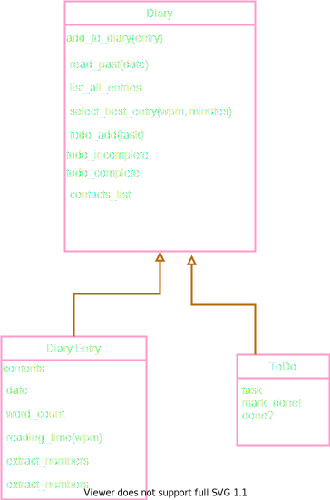

# {{PROBLEM}} Multi-Class Planned Design Recipe

## 1. Describe the Problem

> As a user
> So that I can record my experiences
> I want to keep a regular diary

> As a user
> So that I can reflect on my experiences
> I want to read my past diary entries

> As a user
> So that I can reflect on my experiences in my busy day
> I want to select diary entries to read based on how much time I have and my reading speed

> As a user
> So that I can keep track of my tasks
> I want to keep a todo list along with my diary

> As a user
> So that I can keep track of my contacts
> I want to see a list of all of the mobile phone numbers in all my diary entries

## 2. Design the Class System

_Consider diagramming out the classes and their relationships. Take care to
focus on the details you see as important, not everything. The diagram below
uses asciiflow.com but you could also use excalidraw.com, draw.io, or miro.com_





_Also design the interface of each class in more detail._

```ruby
class Diary
  def initialize
    @diary_entries_list = []
    @to_do_incomplete = []
    @to_do_complete = []
    @contacts_list = []
  end
  def add_to_diary(diary_entry)
    # add the diary entry to diary_entries
  end
  def read_past_entry(date)
    #returns the entry for the given day or returns msg that there is no entry
  end
  def list_all_entries
  end
  def select_best_entry(wpm, minutes)
  end
  def add_todo(task)
  end
  def todo_incomplete
  end
  def todo_complete
  end
  def contacts_list(phone_numbers)
    # returns a list only of unique phone numbers
  end
   
end

class DiaryEntry
  def initialize(date, contents)
    @date = date
    @contents = contents
    @phonenumbers = []
  end
  
  def date
    # returns date as......
  end

  def contents
    #return contents as string
  end
  
  def word_count  #returns the number of words as an integer
  end
  
  def reading_time(wpm) # returns the reading time in minutes to the nearest integer
  end

  def extract_numbers
    # gets the numbers from the contents and adds them to @phonenumbers
    # return @phonenumbers
  end
  
end

class ToDo
  def initialize(task)
    @task = task

  end
  def task
    # returns the task as a string
  end
  def mark_done!

  end
  def done?
  end
end
```

## 3. Create Examples as Integration Tests

_Create examples of the classes being used together in different situations and
combinations that reflect the ways in which the system will be used._

```ruby
1)
diary = Diary.new
diary_entry_1 = DiaryEntry.new("12/10/2022", "Today was a good day.")
diary_entry_2 = DiaryEntry.new("13/10/2022", "Today I ate some cheese, it was tasty.")
diary.add_to_diary(diary_entry_1)
diary.add_to_diary(diary_entry_2)
expect(diary.list_all_entries).to eq [diary_entry_1, diary_entry_2]

2)
diary = Diary.new
diary_entry_1 = DiaryEntry.new("12/10/2022", "Today was a good day.")
diary_entry_2 = DiaryEntry.new("13/10/2022", "Today I ate some cheese, it was tasty.")
diary.add_to_diary(diary_entry_1)
diary.add_to_diary(diary_entry_2)
expect(diary.read_past_entry("12/10/2022")).to eq "Today was a good day."

3) 
diary = Diary.new
diary_entry_1 = DiaryEntry.new("12/10/2022", "Today was a good day.")
diary_entry_2 = DiaryEntry.new("13/10/2022", "Today I ate some cheese, it was tasty.")
diary.add_to_diary(diary_entry_1)
diary.add_to_diary(diary_entry_2)
expect(diary.read_past_entry("09/10/2022")).to eq "There is no entry for this day."

4)
diary = Diary.new
diary_entry_1 = DiaryEntry.new("12/10/2022", "Today was a good day.")
diary_entry_2 = DiaryEntry.new("13/10/2022", "Today I ate some cheese, it was tasty.")
diary_entry_1.reading_time(2)
diary_entry_1.reading_time(2)
diary.add_to_diary(diary_entry_1)
diary.add_to_diary(diary_entry_2)
expect(diary.select_best_entry(2, 4)).to eq diary_entry_2

5)
diary = Diary.new
to_do_1 = ToDo.new("wash up")
to_do_2 = ToDo.new("mop kitchen")
diary.add_todo(to_do_1)
diary.add_todo(to_do_2)
expect(diary.todo_incomplete).to eq [to_do_1, to_do_2]

6)
diary = Diary.new
to_do_1 = ToDo.new("wash up")
to_do_2 = ToDo.new("mop kitchen")
to_do_1.mark_done!
diary.add_todo(to_do_1)
diary.add_todo(to_do_2)
expect(diary.todo_incomplete).to eq [to_do_2]

7)
diary = Diary.new
to_do_1 = ToDo.new("wash up")
to_do_2 = ToDo.new("mop kitchen")
to_do_1.mark_done!
diary.add_todo(to_do_1)
diary.add_todo(to_do_2)
expect(diary.todo_complete).to eq [to_do_1]

8)
diary = Diary.new
diary_entry = DiaryEntry.new("11/10/2022", "Sarah: 07544444444")
diary_entry.extract_numbers
expect(diary.contacts_list).to eq ["07544444444"]

8)
diary = Diary.new
diary_entry_1 = DiaryEntry.new("11/10/2022", "Sarah: 07544444444  Mike: 01546777777" )
diary_entry_2 = DiaryEntry.new("08/10/2022", "Sarah: 07544444444")
diary_entry_1.extract_numbers
diary_entry_2.extract_numbers
expect(diary.contacts_list).to eq ["07544444444", "01546777777"]

```

## 4. Create Examples as Unit Tests

_Create examples, where appropriate, of the behaviour of each relevant class at
a more granular level of detail._

```ruby
Diary:
1)
diary = Diary.new
expect(diary.list_all_entries).to eq "You have no diary entries."

2)
diary = Diary.new
expect(diary.past_diary_entries("12/09/2020")).to eq "You have no diary entries."

3)
diary = Diary.new
expect(diary.select_best_entry(2, 4)).to eq "You have no diary entries."

4) diary = Diary.new
expect(diary.todo_incomplete).to eq "You have nothing in your todo list. Go relax."

5) diary = Diary.new
expect(diary.todo_complete).to eq "You have not completed any tasks because you haven't added anything to your todo list."

DiaryEntry:
1)
diary_entry = DiaryEntry.new("12/10/2022", "Today was a good day.")
expect(diary_entry.entry).to eq "12/10/2022: Today was a good day."
2)
diary_entry = DiaryEntry.new("12/10/2022", "Today was a good day.")
expect(diary_entry.word_count).to eq 5
3)
diary_entry = DiaryEntry.new("12/10/2022", "Today was a good day.")
expect(diary_entry.reading_time(2) = 3

4) 
diary_entry = DiaryEntry.new("12/10/2022", "Sarah: 07544444444.")
expect(diary_entry.extract_numbers).to eq ["07544444444"]

5)
diary_entry = DiaryEntry.new("11/10/2022", "Sarah: 07544444444, Mike: 01526333333")
expect(diary_entry.extract_numbers).to eq ["07544444444", "01526333333"]

ToDo:
1)
to_do = ToDo.new("wash up")
expect(to_do.task).to eq "wash up"

2)
to_do = ToDo.new("wash up")
to_do.mark_done!
expect(to_do.done?).to eq true

3)
to_do = ToDo.new("wash up")
expect(to_do.done?).to eq false


```

_Encode each example as a test. You can add to the above list as you go._

## 5. Implement the Behaviour

_After each test you write, follow the test-driving process of red, green,
refactor to implement the behaviour._


